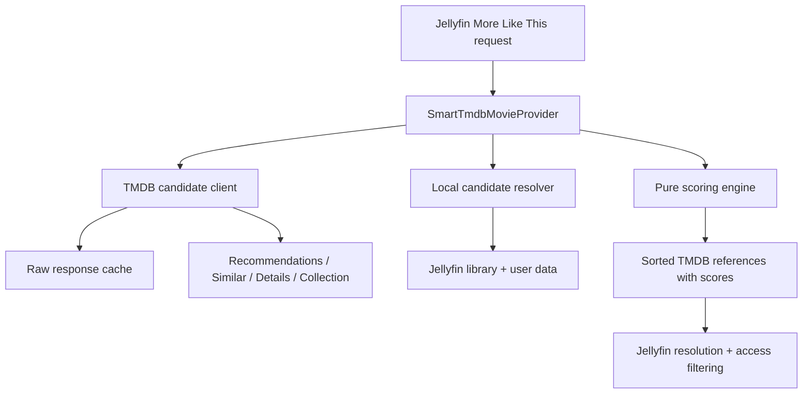

# Smart TMDB Recommendations for Jellyfin 12

## Kilo Code build brief, architecture, endpoint map, and task plan

Research date: 2026-09-08  
Target server: Jellyfin `12.0.0`  
Target framework: `.NET 10` / `net10.0`  
Working plugin name: **Smart TMDB Recommendations**  
Working assembly name: `Jellyfin.Plugin.SmartTmdb`  
Reserved plugin GUID: `20410cf8-e5cd-4307-a355-87c6b66c9ae6`

This document is intended to be placed in the repository as `docs/IMPLEMENTATION_PLAN.md` and given to Kilo Code. The name, namespace, and GUID can be changed before the first published build, but the GUID must then remain stable.

---

## 1. Executive decision

Build a normal Jellyfin 12 server plugin in C# that implements:

```csharp
IRemoteSimilarItemsProvider<Movie>
```

The provider should:

1. Read the current movie's TMDB ID from Jellyfin.
2. Fetch a bounded candidate pool from TMDB recommendations, TMDB similar movies, and—when useful—the movie's collection.
3. Resolve the candidate TMDB IDs against movies already present in the user's Jellyfin server.
4. Filter and re-rank those local movies using the configured style, quality, language, era, franchise, and watched-state preferences.
5. Yield `SimilarItemReference` objects with `ProviderName = "Tmdb"` and an explicit score from `0.0` to `0.95`.
6. Let Jellyfin resolve the references and perform its final library-access/parental-access filtering.

Use a small, hand-written TMDB REST client over `IHttpClientFactory` and `System.Text.Json`. Do not depend on Jellyfin's internal `TmdbClientManager`, reflection, scraping, a Jellyfin fork, jellyfin-web changes, a database, an embedding model, or a recommendation microservice in V1.

The result is deliberately a **smart aggregator and re-ranker**, not a second copy of the basic TMDB provider already built into Jellyfin 12.

### Recommended stack

| Concern | Decision | Why |
|---|---|---|
| Runtime | .NET 10, C# | Jellyfin 12 targets .NET 10 and old 10.11 plugins do not load. |
| Jellyfin API | `Jellyfin.Controller` and `Jellyfin.Model` `12.0.0` | Exact, reproducible match to the first stable Jellyfin 12 ABI. |
| Provider | `IRemoteSimilarItemsProvider<Movie>` | It is selectable and orderable per movie library and returns external IDs that Jellyfin maps to local items. |
| HTTP | `IHttpClientFactory` | Correct connection lifetime, DI, logging, cancellation, and testability. |
| TMDB integration | Small typed client written in the plugin | Only four endpoints are needed in V1; this avoids a large wrapper dependency and keeps request behavior explicit. |
| JSON | `System.Text.Json` | Included in the platform and sufficient for small DTOs. |
| Cache | In-memory cache of raw TMDB responses | No schema or migration burden; a cold cache after restart is acceptable. |
| Configuration | `BasePlugin<PluginConfiguration>` plus embedded HTML/vanilla JS | This is the normal Jellyfin dashboard plugin pattern. |
| Tests | xUnit v3, fake `HttpMessageHandler`, Moq only where useful | Matches Jellyfin 12's own test stack and allows deterministic API fixtures. |
| Packaging | Jellyfin `build.yaml`, DLL artifact, manual install first | Fastest route to an Unraid/Jellyfin test instance; repository distribution can follow. |
| License | GPL-3.0-only | The plugin links against GPL-3.0 Jellyfin assemblies. |

Suggested package baseline, aligned with the Jellyfin `v12.0` source tree:

```xml
<PropertyGroup>
  <TargetFramework>net10.0</TargetFramework>
  <Nullable>enable</Nullable>
  <ImplicitUsings>enable</ImplicitUsings>
  <TreatWarningsAsErrors>true</TreatWarningsAsErrors>
  <GenerateDocumentationFile>true</GenerateDocumentationFile>
</PropertyGroup>

<ItemGroup>
  <PackageReference Include="Jellyfin.Controller" Version="12.0.0">
    <ExcludeAssets>runtime</ExcludeAssets>
  </PackageReference>
  <PackageReference Include="Jellyfin.Model" Version="12.0.0">
    <ExcludeAssets>runtime</ExcludeAssets>
  </PackageReference>
  <PackageReference Include="Microsoft.Extensions.Http" Version="10.0.11" />
</ItemGroup>
```

The controller package already depends on the model package, but keeping both explicit mirrors Jellyfin's plugin template and makes the ABI choice obvious. Do not copy the current `jellyfin-plugin-template` unchanged: at the research date its `master` branch still targets `net9.0` and Jellyfin `10.11.5`.

For the test project, start with the versions used by Jellyfin's own `v12.0` source: `Microsoft.NET.Test.Sdk` `18.9.0`, `xunit.v3` `3.2.2`, `xunit.runner.visualstudio` `3.1.5`, `coverlet.collector` `10.0.1`, and—only where a hand-written fake is not clearer—Moq `4.18.4`.

---

## 2. Findings that change the project design

### 2.1 Jellyfin 12 already contains a TMDB recommendations provider

Jellyfin 12's built-in `TmdbMovieSimilarProvider` already calls:

```http
GET /3/movie/{movie_id}/recommendations
```

It streams the returned TMDB IDs in TMDB order and does not attach a custom score. Therefore, a plugin that only calls that endpoint adds little value and will be confusing beside the built-in provider named `TheMovieDb`.

The custom provider must have a unique display name such as `Smart TMDB Recommendations` and differentiate itself through:

- multiple candidate signals;
- explicit ranking;
- local availability awareness;
- unwatched preferences;
- quality and vote-confidence controls;
- era, language, popularity, and franchise behavior;
- conservative caching and predictable failure fallback.

Never name this provider `TheMovieDb`. Jellyfin de-duplicates provider choices by name, and its enable/order configuration also matches provider names.

### 2.2 "More Like This" and movie suggestion rows are not the same extension path in 12.0.0

The item-detail **More Like This** request goes through `ISimilarItemsManager.GetSimilarItemsAsync` and can use an enabled `IRemoteSimilarItemsProvider<Movie>`. This is the supported V1 target.

The older movie `GET /Recommendations` flow that builds rows such as "Because you watched…" takes the first discovered `IBatchLocalSimilarItemsProvider`. In the exact 12.0.0 source it does not run the selectable remote-provider pipeline. A plugin could attempt to become that first batch provider, but discovery order is not a stable public selection contract and the behavior would be server-wide rather than a clean per-library choice.

Therefore:

- **V1 claim:** improve the item-detail More Like This results for movies.
- **Do not claim in V1:** reliable replacement of every home/movie Suggestions row.
- **V2 experiment:** add `IBatchLocalSimilarItemsProvider` only after a targeted Jellyfin 12 integration test or an upstream change introduces an explicit provider-selection mechanism for those rows.

This distinction should be visible in the README and release notes.

### 2.3 Remote providers are opt-in and ordering affects whether they run

Jellyfin always includes local similarity providers. Remote providers are only used when enabled for that item type in a library's `SimilarItemProviders` setting.

Provider order is operational. At the start of each provider, Jellyfin stops asking additional providers after it already has the requested number of results. The 12.0 migration deliberately places local providers before remote providers. If the local genre/tag provider fills a row first, this plugin may never be called.

The install instructions must say:

1. Open the target movie library's settings.
2. Enable `Smart TMDB Recommendations` under similar-item providers.
3. Put it **above** `Local Genre/Tag` and the built-in `TheMovieDb` provider.
4. Disable the built-in remote `TheMovieDb` provider if duplicate behavior is undesirable. The local provider remains Jellyfin's fallback.

This must also be verified in the manual integration test.

### 2.4 Results are local-only without extra work

The remote provider returns external ID references. Jellyfin resolves those references against the server library using provider IDs and the same media kind. A TMDB candidate not present as a local Jellyfin movie will not appear.

That is ideal for this project: TMDB generates candidates, but the row remains playable. The plugin should still pre-resolve candidate TMDB IDs in one library query because it needs local runtime and watched data for scoring; Jellyfin will perform the authoritative resolution again afterward.

### 2.5 Supplying a score is important

`SimilarItemReference.Score` accepts `0.0` through `1.0`. If a provider omits it, Jellyfin derives a score from position as:

```text
1.0 - (position × 0.02)
```

Jellyfin then adds a small provider-order boost and clamps to `[0, 1]`. This plugin should provide deterministic scores and yield candidates in descending score order. Cap plugin scores at `0.95`; a first-place provider-order boost can then bring the top result to `1.0` without flattening every result.

### 2.6 Jellyfin's remote-provider cache is unsafe for personalized ordering

The core cache path is based on:

```text
provider name + source item type + source Jellyfin item ID
```

It does not include the user ID or a settings hash. If a provider generates results from `query.User` and returns a non-null `CacheDuration`, one user's watched-state ranking can be served to another user.

For this plugin:

```csharp
public TimeSpan? CacheDuration => null;
```

Cache only raw, non-personal TMDB responses inside the plugin. Do not cache the final ranked references in V1. If final-result caching is introduced later, its key must include at least the source TMDB ID, user ID, language, configuration hash, and a watched-state invalidation strategy.

### 2.7 The TMDB API does not directly implement most user-facing settings

The recommendation and similar endpoints accept only:

- `movie_id` in the path;
- `language`;
- `page`.

They do not accept minimum rating, minimum votes, runtime, popularity bias, era, original language, unwatched state, local availability, or franchise preference. Those settings must be local filters or scoring features. `/discover/movie` exposes many such filters, but it creates a new discover search rather than tuning TMDB's recommendation ranking, so it is not the primary V1 source.

---

## 3. Scope

### V1: build this

- Movies only.
- Item-detail More Like This through `IRemoteSimilarItemsProvider<Movie>`.
- TMDB application authentication using an API Read Access Token in a Bearer header.
- Candidate generation from TMDB recommendations and optional similar results.
- Source movie details and optional collection details.
- Local-Jellyfin-only results.
- Presets: Mainstream, Balanced, Explorer, and Custom.
- Watched behavior: Allow, Prefer unwatched, or Unwatched only.
- Franchise behavior: Prefer next, Neutral, or Avoid same collection.
- Minimum TMDB rating and vote count.
- Era similarity, original-language preference, and popularity bias.
- Adult-result exclusion.
- Raw API response caching, cancellation, timeouts, bounded retries, and safe logging.
- Dashboard configuration page with TMDB attribution.
- Unit tests, fixture tests, manual Jellyfin 12 integration checklist, packaging, and install instructions.

### V1.1: useful after the first working build

- A guarded admin-only "Test TMDB connection" endpoint/button.
- Per-library setting overrides, keyed by stable Jellyfin library/folder ID.
- Diagnostics showing candidate counts and reasons for filtering, without logging tokens or user histories.
- Optional short-lived final-result cache with a provably user-safe key and invalidation strategy.

### V2: research before implementing

- Home/movie Suggestions rows through a supported batch-provider selection path.
- Keywords, director, and cast as stronger content signals.
- `/discover/movie` backfill for Explorer mode when the normal candidate pool has too few local matches.
- Persistent recommendation-exposure tracking.
- User-editable per-user preferences.
- TV series support through a separate `IRemoteSimilarItemsProvider<Series>` and TV endpoints.

### Explicitly out of scope

- Autoplay or automatically starting the next movie. A similarity provider returns candidates; it does not control clients or playback.
- Dismiss buttons. The standard interface has no dismissal event or client UI.
- Scraping Letterboxd, IMDb, or other sites.
- Recommending media that is not present locally.
- Modifying jellyfin-web or forking Jellyfin.
- MovieLens, embeddings, vector databases, collaborative-filtering services, or LLM ranking in V1.
- Watch-provider/streaming-availability endpoints; local Jellyfin availability is the only availability signal needed.

---

## 4. Runtime architecture



### Request sequence

1. Jellyfin calls `GetSimilarItemsAsync(Movie item, SimilarItemsQuery query, CancellationToken ct)`.
2. Return no results if there is no source TMDB ID, no configured token, or cancellation was requested.
3. Take a validated immutable snapshot of the plugin configuration.
4. Fetch source details, with page-one recommendations and similar movies appended where practical.
5. Fetch any configured additional pages.
6. If the source belongs to a collection and franchise behavior is not Neutral, fetch that collection once.
7. Merge candidates by TMDB ID while retaining each source rank.
8. Remove the source movie, adult candidates, and candidates failing hard rating/vote filters.
9. Resolve all remaining TMDB IDs against local movies in one `ILibraryManager.GetItemList` query.
10. Fetch the user's local data for those items in one batch when `query.User` is available.
11. Score local candidates with a pure deterministic scorer.
12. Apply `query.ExcludeItemIds`, sort by score descending and TMDB ID ascending as the final tie-breaker, take the requested number of accessible local results, then stream references.
13. Do not stop at `query.Limit` before local resolution. Many TMDB candidates may not exist locally. Build a larger bounded pool first, then take up to `query.Limit ?? 50` after resolution/filtering. If fewer survive, yield fewer so Jellyfin can call its next ordered provider.
14. Jellyfin resolves the references again, de-duplicates them, applies access controls, and stops when the requested row is full.

### Service boundaries

```text
SmartTmdbMovieProvider
  depends on ITmdbClient
  depends on ILocalMovieResolver
  depends on ICandidateScorer
  depends on IPluginSettingsAccessor
  depends on ILogger<SmartTmdbMovieProvider>

ITmdbClient
  owns HTTP request construction, auth, DTO deserialization,
  pagination calls, raw cache, retry/timeout behavior

ILocalMovieResolver
  owns TMDB-ID-to-BaseItem lookup and batch user-data lookup

ICandidateScorer
  pure code: inputs + settings -> score and reason list

IPluginSettingsAccessor
  reads current PluginConfiguration and returns a validated snapshot
```

Keep the scorer free of HTTP, Jellyfin services, static state, and wall-clock access. Pass any required time as an input. This makes most behavior testable without starting Jellyfin.

---

## 5. Exact Jellyfin 12 contract

The provider shape is:

```csharp
public sealed class SmartTmdbMovieProvider : IRemoteSimilarItemsProvider<Movie>
{
    public string Name => "Smart TMDB Recommendations";

    public MetadataPluginType Type => MetadataPluginType.SimilarityProvider;

    // Required because final order may use query.User.
    public TimeSpan? CacheDuration => null;

    public async IAsyncEnumerable<SimilarItemReference> GetSimilarItemsAsync(
        Movie item,
        SimilarItemsQuery query,
        [EnumeratorCancellation] CancellationToken cancellationToken)
    {
        // Implementation belongs here.
    }
}
```

Each result must use the metadata-provider key, not the plugin's display name:

```csharp
yield return new SimilarItemReference
{
    ProviderName = MetadataProvider.Tmdb.ToString(), // "Tmdb"
    ProviderId = candidate.TmdbId.ToString(CultureInfo.InvariantCulture),
    Score = candidate.Score
};
```

Relevant query inputs:

| Property | Use |
|---|---|
| `query.User` | Read watched/favorite/rating state; may be null. |
| `query.Limit` | Desired local result count, not the maximum number of TMDB references to examine. |
| `query.ExcludeItemIds` | Exclude local items requested by Jellyfin. |
| `query.DtoOptions` | Pass through when appropriate for local queries; do not mutate caller-owned objects. |
| `query.ExcludeArtistIds` | Not relevant to movies. |

Provider discovery is automatic for public concrete implementations. Register supporting services with a public, parameterless `IPluginServiceRegistrator`; do not explicitly register a second `ISimilarItemsProvider` instance.

```csharp
public sealed class PluginServiceRegistrator : IPluginServiceRegistrator
{
    public void RegisterServices(
        IServiceCollection services,
        IServerApplicationHost applicationHost)
    {
        services.AddSingleton<IPluginSettingsAccessor, PluginSettingsAccessor>();
        services.AddSingleton<IRawTmdbCache, MemoryRawTmdbCache>();
        services.AddTransient<ITmdbClient, TmdbClient>();
        services.AddTransient<ILocalMovieResolver, LocalMovieResolver>();
        services.AddSingleton<ICandidateScorer, CandidateScorer>();
    }
}
```

Use the `IHttpClientFactory` already available from Jellyfin. A simple named client is safer here than a typed client captured by a singleton. Create short-lived clients with a constant name such as `SmartTmdb`, set the base URI to `https://api.themoviedb.org/3/`, and attach the current Bearer token per request so a saved token change takes effect without a server restart.

---

## 6. TMDB endpoint plan

### V1 call strategy

For a normal request with three recommendation pages, one similar page, and no collection:

```http
GET /3/movie/{id}?language=en-US&append_to_response=recommendations,similar
GET /3/movie/{id}/recommendations?language=en-US&page=2
GET /3/movie/{id}/recommendations?language=en-US&page=3
```

The details response supplies source genre IDs, original language, release date, rating fields, and `belongs_to_collection`; the appended objects supply page one of each candidate source. If append parsing becomes awkward during the initial scaffold, make the three concerns separate calls first, lock behavior with fixtures, and optimize to `append_to_response` afterward.

If the source has a collection and franchise behavior needs it:

```http
GET /3/collection/{collection_id}?language=en-US
```

TMDB has no explicit universal "direct sequel" edge here. Infer a likely next installment only when the source appears in collection parts and another dated part has the nearest strictly later release date. Do not invent an order when dates are missing. Collections may include prequels and spin-offs, so this must remain a configurable ranking heuristic, not a hard truth.

### Endpoint map

| Endpoint | V1 purpose | Inputs | Useful response fields | Do not use it for |
|---|---|---|---|---|
| `GET /3/movie/{id}/recommendations` | Primary candidate generator | `id`, `language`, `page` | candidate `id`, `adult`, `genre_ids`, `original_language`, `release_date`, `popularity`, `vote_average`, `vote_count` | Directly applying rating, runtime, era, or popularity settings; the endpoint has no such parameters. |
| `GET /3/movie/{id}/similar` | Secondary content-based candidates | `id`, `language`, `page` | same compact movie result fields | Treating it as a perfect similarity oracle; TMDB describes it as genre/keyword based and cautions that results are imperfect. |
| `GET /3/movie/{id}` | Source features and collection ID | `id`, `language`, optional `append_to_response` | genres, original language, release date, runtime, rating/votes, `belongs_to_collection` | Fetching every candidate's details. Candidate-list fields plus local Jellyfin data should prevent an N+1 request pattern. |
| `GET /3/collection/{collection_id}` | Franchise/next-installment heuristic | `collection_id`, `language` | collection parts and their IDs/dates | Assuming every chronological part is a literal sequel. |
| `GET /3/movie/{id}/keywords` | V2 source or candidate feature | `id` | keyword IDs/names | V1 per-candidate calls. If used, append it to details or cache it. |
| `GET /3/movie/{id}/credits` | V2 cast/director feature | `id`, `language` | cast and crew | V1 per-candidate calls. Prefer already-local Jellyfin people metadata first. |
| `GET /3/movie/{id}/release_dates` | V2 regional certification | `id` | country-specific certifications and release types | Comparing certification strings globally without Jellyfin's rating system. |
| `GET /3/discover/movie` | V2 Explorer backfill | 30+ filters | filtered search results | Replacing recommendations in V1. It creates a new discovery query rather than tuning the recommendations endpoint. |

### Authentication

Use TMDB application authentication:

```http
Authorization: Bearer {API_READ_ACCESS_TOKEN}
Accept: application/json
```

Prefer the Bearer token over an `api_key` query parameter because URLs are more likely to be logged. Resolve credentials in this order:

1. `JELLYFIN_SMART_TMDB_TOKEN` environment variable, if set.
2. Plugin configuration value.

Never write the token, full Authorization header, or credential-bearing URL to logs. The dashboard input must be `type="password"` and must not echo a configured environment token.

Jellyfin has a bundled TMDB metadata provider, but this new plugin should not reach into its internal client or private key. Those implementation classes are not part of the stable plugin package contract.

### Rate and failure behavior

- Default request timeout: 10 seconds.
- Maximum outbound concurrency per server: 2 requests.
- Cache successful raw responses for 24 hours by default.
- Coalesce concurrent identical cache misses so ten page loads do not send ten identical TMDB calls.
- On `429`, honor `Retry-After`; retry once if the requested delay is at most 10 seconds, otherwise fail fast and let Jellyfin's next provider fill the row.
- On `500`, `502`, `503`, `504`, timeout, or transient network failure, retry once with a small jittered delay.
- Do not retry `400`, `401`, `403`, or `404`.
- Always propagate the caller's cancellation token.
- Never return stale personalized results. Serving a still-valid raw TMDB cache entry is safe because it contains no Jellyfin user data.

TMDB documents a soft upper limit in roughly the 40 requests/second range, says it can change, and requires clients to respect `429`. It also offers no SLA. This plugin should stay far below that through small candidate pools and caching.

### Attribution

The dashboard/About area must include an approved TMDB logo and this notice:

> This product uses the TMDB API but is not endorsed or certified by TMDB.

The TMDB mark should be less prominent than the plugin name. Confirm current licensing requirements again before publishing commercially.

---

## 7. Settings-to-endpoint/algorithm map

The most important distinction is whether a setting becomes a request parameter, a local post-filter, a ranking feature, or a Jellyfin-native access rule.

| User-facing setting | Suggested config field/default | TMDB/Jellyfin mapping | V1 behavior |
|---|---|---|---|
| TMDB API Read Access Token | `ApiReadAccessToken = ""` | Bearer header on every TMDB call; environment variable takes precedence. | Required unless env var is set. Missing/invalid token returns no plugin results so the next provider can handle the row. |
| Recommendation style | `Preset = Balanced` | Expands to weights, candidate pages, thresholds, and popularity direction. | Mainstream, Balanced, Explorer, Custom. |
| TMDB Recommendations | `UseRecommendations = true` | `/movie/{id}/recommendations`; `RecommendationPages = 3`. | Primary ranked signal. Global rank spans pages. |
| TMDB Similar | `UseSimilar = true` | `/movie/{id}/similar`; `SimilarPages = 1`. | Secondary signal with a lower weight. |
| Prefer unwatched | `WatchedMode = PreferUnwatched` | Local `IUserDataManager` batch data. No TMDB parameter. | Allow: no adjustment. Prefer: penalize played. Only: hard-filter played. If user is null, behave as Allow. |
| Franchise behavior | `FranchiseMode = PreferNext` | Source details `belongs_to_collection`, then `/collection/{id}`. | PreferNext: strong likely-next bonus and small same-collection bonus. Neutral: no collection call required. Avoid: penalize same collection. |
| Minimum TMDB rating | `MinimumVoteAverage = 5.5` | Candidate `vote_average` from recommendation/similar response. | Hard post-filter; do not translate to `/discover`. |
| Minimum TMDB votes | `MinimumVoteCount = 100` | Candidate `vote_count`. | Hard post-filter, followed by a Bayesian quality feature for ranking. |
| Popularity bias | `PopularityBias = 0` in range `-2..2` | Candidate `popularity`; no recommendation-endpoint parameter. | Rank by log-scaled percentile within the fetched pool. Negative favors less popular candidates; positive favors popular ones. |
| Release era | `EraMode = Soft`, `EraHalfLifeYears = 15` | Source and candidate release years. | Off: no feature. Soft: exponential closeness. Strict10: filter beyond ±10 years. |
| Original language | `LanguageMode = PreferSource` | TMDB `original_language`, not the translated title language. | Any: no adjustment. PreferSource: small match bonus/mismatch penalty. OnlySource: hard filter. |
| TMDB response language | `ResponseLanguage = "auto"` | `language` on details, recommendations, similar, and collection. Resolve `auto` from the source/Jellyfin preference, with `en-US` fallback. | Advanced setting. It localizes returned metadata but is not the same as filtering original language. |
| Region | `Region = "NO"` | Useful on `/discover` and regional release/certification flows, but **not accepted by recommendations/similar**. | Hide or omit in V1; reserve for V2. Do not pretend it changes recommendation ranking. |
| Adult content | `IncludeAdult = false` | Candidate `adult` flag; recommendations/similar do not offer an `include_adult` switch. | Locally discard adult candidates unless explicitly enabled; Jellyfin still performs final access filtering. |
| Runtime similarity | `RuntimeMode = Off` | Prefer local `BaseItem.RunTimeTicks` after candidate resolution. | Defer to V1.1 if desired. Never fetch detail once per candidate merely for runtime. |
| Age rating ceiling | No new V1 setting | Jellyfin's user/library access and parental rating logic; final manager filtering. | Rely on Jellyfin. Country-specific TMDB certifications are not safely comparable as a single ordered string. |
| Local availability only | Always true | Jellyfin matches `ProviderName="Tmdb"` and ID to local movies. | Architectural invariant, not a toggle. |
| Result count | Controlled by caller | `query.Limit`. | Do not expose another competing setting. Candidate pool may be larger than this. |
| Candidate pages | `RecommendationPages = 3`, `SimilarPages = 1` | `page` query parameter. | Advanced; clamp each to `1..5` and total candidates to 200. |
| Raw cache duration | `RawCacheHours = 24` | Plugin in-memory cache of HTTP response DTOs. | Clamp to `1..168`; config changes invalidate affected keys. |
| Recommendation cooldown | None in V1 | Would require persistent tracking of recommendations returned and cannot prove they were shown. | Defer. Do not label provider returns as actual impressions. |
| Dismissed movies | None | No standard dismissal event/UI in this provider interface. | Out of scope. |
| Per-user editable style | None in V1 | Admin plugin config is global; `query.User` supports automatic watched-state personalization but not a native preference UI. | Defer editable profiles. |
| Autoplay | None | Not supported by similarity-provider contract. | Out of scope. |

### Recommended V1 configuration model

Use enums rather than magic strings or unbounded numeric knobs. Validate and clamp every value when creating a settings snapshot.

```csharp
public sealed class PluginConfiguration : BasePluginConfiguration
{
    public string ApiReadAccessToken { get; set; } = string.Empty;
    public RecommendationPreset Preset { get; set; } = RecommendationPreset.Balanced;
    public WatchedMode WatchedMode { get; set; } = WatchedMode.PreferUnwatched;
    public FranchiseMode FranchiseMode { get; set; } = FranchiseMode.PreferNext;
    public EraMode EraMode { get; set; } = EraMode.Soft;
    public LanguageMode LanguageMode { get; set; } = LanguageMode.PreferSource;
    public string ResponseLanguage { get; set; } = "auto";
    public bool IncludeAdult { get; set; }
    public bool UseRecommendations { get; set; } = true;
    public bool UseSimilar { get; set; } = true;
    public int RecommendationPages { get; set; } = 3;
    public int SimilarPages { get; set; } = 1;
    public double MinimumVoteAverage { get; set; } = 5.5;
    public int MinimumVoteCount { get; set; } = 100;
    public int PopularityBias { get; set; }
    public int EraHalfLifeYears { get; set; } = 15;
    public int RawCacheHours { get; set; } = 24;
    public int RequestTimeoutSeconds { get; set; } = 10;
    public ScoringWeights CustomWeights { get; set; } = ScoringWeights.Balanced;
}
```

Do not let the HTML page be the only validation layer. A malformed configuration file must not create unlimited pages, negative timeouts, NaN weights, or unbounded cache entries.

### Preset expansion

Presets should produce a complete immutable settings snapshot. Values below are starting points to test, not claims of statistical optimality.

| Preset | Rec. pages | Similar pages | Rec. | Similar | Genre | Era | Quality | Popularity | Min votes | Popularity direction |
|---|---:|---:|---:|---:|---:|---:|---:|---:|---:|---:|
| Mainstream | 2 | 1 | 0.60 | 0.10 | 0.05 | 0.05 | 0.10 | 0.10 | 250 | +1 |
| Balanced | 3 | 1 | 0.55 | 0.15 | 0.10 | 0.05 | 0.10 | 0.05 | 100 | 0 |
| Explorer | 3 | 2 | 0.40 | 0.25 | 0.15 | 0.05 | 0.10 | 0.05 | 50 | -1 |
| Custom | Configured | Configured | User values, normalized at runtime | | | | | | Configured | Configured |

In Mainstream, popularity's feature is the popularity percentile. In Explorer, it is `1 - percentile`. In Balanced with a zero bias, set the popularity weight to zero and renormalize active weights. A future UI slider can interpolate between profiles, but named presets are easier to explain and test in V1.

---

## 8. Candidate and scoring design

### Candidate record

The aggregator should retain evidence rather than overwriting one source with another:

```csharp
public sealed record RecommendationCandidate(
    int TmdbId,
    int? RecommendationRank,
    int? SimilarRank,
    IReadOnlySet<int> GenreIds,
    string? OriginalLanguage,
    DateOnly? ReleaseDate,
    double VoteAverage,
    int VoteCount,
    double Popularity,
    bool Adult,
    bool IsInSourceCollection,
    bool IsLikelyNextCollectionPart,
    BaseItem? LocalItem,
    UserItemData? UserData);
```

If the same TMDB ID appears on multiple pages or sources, keep the best rank from each source. Reject impossible IDs and tolerate missing optional metadata.

### Feature functions

All base features return a finite value in `[0, 1]`.

#### Ranked-source score

```text
rankScore(rank) = exp(-(rank - 1) / 24)
```

Missing rank produces zero. This preserves TMDB's order but prevents page-one results from being almost indistinguishable.

#### Genre overlap

Use TMDB genre IDs from source details and candidate results:

```text
genreScore = |sourceGenres ∩ candidateGenres| / |sourceGenres ∪ candidateGenres|
```

Return zero if the union is empty.

#### Era closeness

```text
eraScore = exp(-ln(2) × abs(sourceYear - candidateYear) / halfLifeYears)
```

With a 15-year half-life, a movie 15 years away scores `0.5` on this feature. Missing dates contribute no era feature rather than failing the candidate.

#### Bayesian quality

Do not rank a `9.5` with 12 votes above an `8.0` with 100,000 votes solely from average rating:

```text
quality = (v / (v + m)) × (R / 10) + (m / (v + m)) × (C / 10)
```

Where:

- `R` is candidate vote average;
- `v` is vote count;
- `m = 250` is the confidence prior;
- `C = 6.0` is the prior mean.

The separate minimum-vote and minimum-rating settings remain hard filters.

#### Popularity

Calculate a stable percentile from `log1p(popularity)` within the fetched candidate pool. Winsorize extreme values. Depending on the user's bias:

- mainstream feature = percentile;
- hidden-gem feature = `1 - percentile`;
- neutral = omit and renormalize.

Popularity is relative and volatile; do not persist it indefinitely or compare the raw value to a user-visible universal scale.

### Base score

```text
base = weightedAverage(
  recommendationRankScore,
  similarRankScore,
  genreScore,
  eraScore,
  qualityScore,
  popularityScore
)
```

Normalize the enabled non-negative weights. Reject a Custom profile in which every weight is zero.

### Adjustments

Apply small explainable adjustments after the base score:

| Rule | Starting adjustment |
|---|---:|
| Unwatched with `PreferUnwatched` | `+0.03` |
| Played with `PreferUnwatched` | `-0.20` |
| Original language match with `PreferSource` | `+0.03` |
| Original language mismatch with `PreferSource` | `-0.03` |
| Likely next collection part with `PreferNext` | `+0.20` |
| Other same-collection part with `PreferNext` | `+0.05` |
| Same collection with `Avoid` | `-0.25` |

Hard modes filter before scoring:

- `UnwatchedOnly` removes played movies.
- `OnlySourceLanguage` removes known mismatches.
- `Strict10` era removes candidates more than 10 years from the source.
- `IncludeAdult = false` removes candidates marked adult.
- rating/vote thresholds remove candidates below either threshold.

Final score:

```text
score = clamp(base + adjustments, 0.0, 0.95)
```

Order by final score descending, then best recommendation rank, best similar rank, then TMDB ID ascending. The last key guarantees stable output across runs.

For debugging and tests, let the scorer optionally produce reason codes such as:

```text
tmdb-recommendation-rank:0.82
genre-overlap:0.50
played-penalty:-0.20
likely-next:+0.20
```

Do not expose detailed user watch-state reasons to non-admin logs.

### Fallback behavior

The plugin should return an empty sequence—not throw outward—when:

- the source has no valid TMDB ID;
- credentials are unavailable or rejected;
- TMDB is unavailable after bounded retry;
- no fetched candidate exists locally;
- hard filters remove every candidate.

Jellyfin can then continue to its next ordered provider, usually the local genre/tag provider. Do not silently relax a user's hard filters.

---

## 9. Local Jellyfin data strategy

### Batch resolve candidate IDs

Use a single `InternalItemsQuery` with `HasAnyProviderIds`, scoped to movies:

```csharp
var query = new InternalItemsQuery(user)
{
    IncludeItemTypes = [BaseItemKind.Movie],
    HasAnyProviderIds = new Dictionary<string, string[]>
    {
        [MetadataProvider.Tmdb.ToString()] = tmdbIds
    },
    ExcludeItemIds = excludedItemIds,
    EnableGroupByMetadataKey = true,
    EnableTotalRecordCount = false
};

if (user is not null)
{
    libraryManager.ConfigureUserAccess(query, user);
}

var localMovies = libraryManager.GetItemList(query);
```

The exact query may require small adjustments after compilation against `12.0.0`, but the key design is one provider-ID lookup for the entire pool, not one library scan per TMDB ID.

Build mappings for both local item ID and TMDB ID. If multiple local versions map to the same presentation item, pick deterministically and let Jellyfin's final resolution/de-duplication remain authoritative. Pre-filtering with `ConfigureUserAccess` prevents inaccessible candidates from consuming the requested limit; Jellyfin's manager still performs the authoritative final access check.

### Batch user data

When `query.User` is not null, use `IUserDataManager.GetUserDataBatch` for all locally matched candidates. Use `Played` and, if later desired, favorite/rating/play count. V1 personalization should depend only on watched state; this is easily explained and tested.

When user is null, do not create an artificial user or read another user's data. Treat watched preference as Allow.

### Access and parental controls

Jellyfin's manager performs a final access filter after it resolves provider references. Do not bypass this by returning `BaseItem` objects through a different interface in V1. Avoid logging candidate names or IDs at normal information level when a user may not have access to them.

---

## 10. Cache design

### Core provider cache

Disabled:

```csharp
public TimeSpan? CacheDuration => null;
```

This is a correctness requirement while ranking uses `query.User`.

### Plugin raw cache

Cache key:

```text
HTTP method + normalized TMDB path + sorted non-secret query parameters
```

Include language and page. Do not include the Bearer token in the key or logs. Clear the cache when the token changes; language is already part of the key. Store parsed immutable DTOs or the response bytes, not `HttpResponseMessage` objects.

Required properties:

- bounded entry count, for example 2,000;
- sliding or absolute TTL, default 24 hours;
- no caching of `401`, `403`, `404`, `429`, or 5xx responses;
- request coalescing for identical in-flight keys;
- cancellation of one waiter must not corrupt a successfully running shared fetch;
- no final user-personalized ranking in this cache.

An `IMemoryCache` wrapper is sufficient. No SQLite/file persistence is needed for V1.

---

## 11. Configuration page

Use an embedded dashboard page exposed by `IHasWebPages` and the standard Jellyfin calls:

```javascript
ApiClient.getPluginConfiguration(pluginId)
ApiClient.updatePluginConfiguration(pluginId, config)
```

Keep the initial screen small:

```text
SMART TMDB RECOMMENDATIONS

TMDB API Read Access Token       [••••••••••••]
Recommendation style             [Balanced ▼]
Watched movies                   [Prefer unwatched ▼]
Franchise behavior               [Prefer likely next part ▼]
Minimum TMDB rating              [5.5]
Minimum TMDB votes               [100]
Release era                      [Soft preference ▼]
Original language                [Prefer source language ▼]
Include adult candidates         [ ]

Advanced
  Recommendations pages          [3]
  Similar pages                  [1]
  TMDB response language         [auto]
  Raw cache duration             [24 hours]
  Custom scoring weights         [collapsed; Custom preset only]

[Save]

TMDB attribution and link
```

UI requirements:

- Use Jellyfin's `emby-input`, `emby-select`, `emby-checkbox`, and `emby-button` components.
- Put descriptions beneath settings that are easy to misunderstand.
- Disable custom weight controls unless Custom is selected.
- Validate numeric ranges client-side for convenience and server-side for safety.
- Never replace a saved token with bullets. If the password field is left blank, preserve the existing token; provide a separate explicit Clear action.
- If the environment variable supplies the token, show "Configured by environment" and keep the input empty.
- Include TMDB attribution in the page/About section.
- Configuration changes should affect the next request without requiring a server restart.

The `Plugin` class should derive from `BasePlugin<PluginConfiguration>, IHasWebPages`, use the reserved GUID, retain a static `Instance` only where Jellyfin's configuration pattern requires it, and expose the embedded page.

---

## 12. Proposed repository layout

```text
Jellyfin.Plugin.SmartTmdb/
├── AGENTS.md
├── LICENSE
├── README.md
├── build.yaml
├── Jellyfin.Plugin.SmartTmdb.sln
├── kilo.jsonc
├── .kilo/
│   └── commands/
│       └── next-task.md
├── docs/
│   ├── IMPLEMENTATION_PLAN.md
│   ├── STATUS.md
│   └── MANUAL_TESTS.md
├── src/
│   └── Jellyfin.Plugin.SmartTmdb/
│       ├── Jellyfin.Plugin.SmartTmdb.csproj
│       ├── Plugin.cs
│       ├── PluginServiceRegistrator.cs
│       ├── Configuration/
│       │   ├── PluginConfiguration.cs
│       │   ├── SettingsSnapshot.cs
│       │   └── configPage.html
│       ├── Providers/
│       │   └── SmartTmdbMovieProvider.cs
│       ├── Tmdb/
│       │   ├── ITmdbClient.cs
│       │   ├── TmdbClient.cs
│       │   ├── TmdbDtos.cs
│       │   └── RawTmdbCache.cs
│       ├── Recommendations/
│       │   ├── RecommendationCandidate.cs
│       │   ├── CandidateAggregator.cs
│       │   ├── ICandidateScorer.cs
│       │   └── CandidateScorer.cs
│       └── Jellyfin/
│           ├── ILocalMovieResolver.cs
│           └── LocalMovieResolver.cs
└── tests/
    └── Jellyfin.Plugin.SmartTmdb.Tests/
        ├── Jellyfin.Plugin.SmartTmdb.Tests.csproj
        ├── Fixtures/
        ├── CandidateAggregatorTests.cs
        ├── CandidateScorerTests.cs
        ├── TmdbClientTests.cs
        └── SmartTmdbMovieProviderTests.cs
```

Avoid `Utils`, `Helpers`, and giant service classes. File and type names should describe one responsibility.

---

## 13. Build backlog for Kilo Code

Kilo should implement one task at a time. Every task ends with build/tests and an update to `docs/STATUS.md`. It should stop for review rather than rolling directly into the next task.

### Task 0 — repository guardrails and API verification

Deliverables:

- Add this document as `docs/IMPLEMENTATION_PLAN.md`.
- Add `AGENTS.md` from Appendix A.
- Add `docs/STATUS.md` with the task list and an empty Decisions/Discrepancies section.
- Check out or clone Jellyfin tag `v12.0` outside the plugin repository for reference.
- Verify NuGet `Jellyfin.Controller` and `Jellyfin.Model` `12.0.0` exist and target `net10.0`.
- Verify the exact interface signatures used in this document against commit `6c073e19ddf604b2369c638716164fdab4c952dc`.

Acceptance criteria:

- Kilo reports any discrepancy before writing production code.
- No API is copied from a 10.11 tutorial without verification.
- No code is implemented in this task.

### Task 1 — solution and compile-only plugin skeleton

Deliverables:

- Solution, production project, and test project.
- `net10.0` and exact Jellyfin `12.0.0` references with runtime assets excluded.
- `Plugin`, empty validated configuration, embedded minimal page, `PluginServiceRegistrator`, and a provider skeleton.
- `build.yaml` with:

```yaml
name: "Smart TMDB Recommendations"
guid: "20410cf8-e5cd-4307-a355-87c6b66c9ae6"
version: "0.1.0.0"
targetAbi: "12.0.0.0"
framework: "net10.0"
owner: "PROJECT_OWNER"
overview: "Configurable TMDB-based movie recommendations for Jellyfin."
category: "General"
artifacts:
  - "Jellyfin.Plugin.SmartTmdb.dll"
```

Acceptance criteria:

- `dotnet restore`, `dotnet build`, and `dotnet test` pass.
- Provider name is unique, type is `SimilarityProvider`, and core cache duration is null.
- The skeleton makes no network calls.
- The repository contains no API token.

### Task 2 — pure domain model, aggregation, and scoring

Deliverables:

- Candidate record and preset/settings snapshot.
- Candidate merge logic retaining the best rank from both sources.
- Feature functions and final scorer described in Section 8.
- Optional score-reason output for tests/debugging.

Acceptance criteria:

- Unit tests cover rank decay, genre Jaccard, era half-life, Bayesian vote confidence, popularity direction, missing data, filters, franchise modes, watched modes, normalization, clamping, and stable tie-breaking.
- The scorer has no HTTP or Jellyfin dependencies.
- NaN, infinity, negative weights, and all-zero weights are rejected or normalized safely.

### Task 3 — TMDB client and raw cache

Deliverables:

- Minimal DTOs containing only used fields.
- Client methods for source details/appended page one, additional recommendation pages, additional similar pages, and collection details.
- Bearer authentication, language/page encoding, cancellation, timeout, bounded retry, concurrency limit, raw cache, and request coalescing.
- Redacted structured logs.

Acceptance criteria:

- Tests use a fake `HttpMessageHandler`; no live TMDB request in unit tests.
- JSON fixtures cover valid results, missing optional fields, empty pages, malformed JSON, 401, 404, 429 with `Retry-After`, 500 then success, timeout, and cancellation.
- Token never appears in exception messages, log assertions, cache keys, or request URIs.
- Fetches stop at configured page/total-page bounds and the global candidate cap.

### Task 4 — local candidate resolution and user data

Deliverables:

- Batch TMDB-ID lookup through `ILibraryManager`.
- Deterministic de-duplication.
- Batch `IUserDataManager` lookup when a user is present.
- Mapping of `query.ExcludeItemIds` to candidates.

Acceptance criteria:

- One library lookup handles the full candidate pool.
- One user-data batch handles the locally resolved pool.
- Null user does not fail and disables watched personalization.
- Only local movie items are returned to the provider layer.

### Task 5 — working remote similar-items provider

Deliverables:

- End-to-end provider orchestration using Tasks 2–4.
- Correct source TMDB ID parsing.
- Empty/fallback behavior and structured count logging.
- Sorted `SimilarItemReference` output with `ProviderName = "Tmdb"`.

Acceptance criteria:

- Source with no TMDB ID causes zero API calls and zero results.
- Missing token causes zero API calls and zero results.
- Candidate pool is not prematurely truncated to `query.Limit` before local resolution.
- Output scores are finite, in `[0, 0.95]`, deterministic, and descending.
- Cancellation stops work promptly.
- A provider failure does not throw through the async enumeration after logging a safe warning.
- `CacheDuration` remains null.

### Task 6 — full dashboard configuration

Deliverables:

- UI from Section 11.
- Server-side settings snapshot validation.
- Environment-token precedence and safe token update/clear behavior.
- TMDB attribution.

Acceptance criteria:

- Every visible setting maps to documented behavior and has a useful description.
- Saving a blank password field does not erase an existing token unless Clear is chosen.
- Invalid numeric values cannot reach the runtime client/scorer.
- Changing a setting affects the next recommendation request.

### Task 7 — packaging and operator documentation

Deliverables:

- GPL-3.0-only license.
- README with prerequisites, TMDB token creation, build, install, upgrade, configuration, troubleshooting, attribution, and limitations.
- Explicit per-library provider enable/order steps.
- `docs/MANUAL_TESTS.md`.

Acceptance criteria:

- Release output contains the plugin DLL and only required plugin-owned dependencies; it does not ship Jellyfin server assemblies.
- README says the first supported target is Jellyfin 12.0.0/.NET 10.
- README accurately limits V1 to movie item-detail More Like This.
- README says results are local-only and explains fallback.

### Task 8 — Jellyfin 12 integration test

Use a disposable Jellyfin 12.0.0 instance and a small movie library with known TMDB IDs.

Test cases:

1. Plugin loads with no assembly errors.
2. Configuration page loads, saves, and reloads.
3. Provider appears as `Smart TMDB Recommendations` for Movie libraries.
4. With the provider disabled, behavior is unchanged.
5. With it enabled but below Local Genre/Tag, logs demonstrate whether the earlier provider fills the row.
6. With it first, it is invoked and its ordering is visible on a movie detail page.
7. TMDB titles absent from the local library never appear.
8. A bad token fails cleanly and local fallback still supplies results.
9. `PreferUnwatched` changes ordering for a test user.
10. Two users with different watched states do not receive cross-user cached ordering.
11. Child/restricted user cannot receive a movie outside their Jellyfin access rules.
12. Restart, plugin update, and uninstall are clean.

Acceptance criteria:

- Record server version, plugin version, setup, expected/actual result, and relevant redacted logs for every case.
- Fix failures before adding V2 features.

### Task 9 — post-V1 evaluation

Only after Task 8 passes:

- Measure TMDB calls, raw-cache hit rate, candidates fetched, candidates locally matched, and latency.
- Collect several representative source movies and compare built-in TMDB, Local Genre/Tag, and Smart TMDB results.
- Adjust starting weights only with documented examples and regression tests.
- Decide whether per-library overrides are worth the UI complexity.
- Re-check upstream Jellyfin code/releases for a supported Suggestions-row extension path.

---

## 14. Required automated test matrix

| Area | Minimum cases |
|---|---|
| Configuration | Defaults, each preset, Custom normalization, zero/negative/NaN weights, page/timeout/cache clamps, environment-token precedence. |
| Authentication | Bearer header present; token absent from URI, logs, exceptions, and cache key. |
| Pagination | One page, multiple pages, early empty page, reported final page, configured max, global cap, cancellation. |
| Aggregation | Candidate only in recommendations, only in similar, in both, duplicate across pages, source item returned by TMDB, invalid ID. |
| Filters | Adult, vote average, vote count, strict era, strict language, watched only, excluded local IDs. |
| Scoring | All feature boundaries, missing fields, franchise modes, watched preference, popularity ± direction, stable tie, clamp. |
| Collection | Source not in parts, missing dates, nearest later part, earlier prequel, several later parts, candidate not local. |
| Local resolver | No matches, partial matches, duplicate versions, non-movie item with same provider ID, null user, different users. |
| HTTP failures | 400, 401, 403, 404, 429 short/long retry, transient 5xx, malformed JSON, timeout, DNS/network exception, cancellation. |
| Provider | Missing source TMDB ID, missing token, zero local matches, successful ordered refs, partial TMDB failure, query limit smaller than candidate pool. |
| Privacy/cache | Raw cache shared safely; final results not core-cached; user A watched state never changes user B output. |

Prefer behavioral tests over private-method tests. Keep fixture responses small and derived from the documented TMDB schema; do not commit real tokens.

---

## 15. Logging and diagnostics

Use structured logs with aggregate values:

```text
Smart TMDB source={SourceItemId} fetched={FetchedCount} deduped={DedupedCount}
localMatches={LocalMatchCount} filtered={FilteredCount} yielded={YieldedCount}
cacheHits={CacheHitCount} elapsedMs={ElapsedMs}
```

Guidelines:

- Information: startup/config validation problems and high-level failures.
- Debug: candidate counts, cache hits, endpoint names, page numbers, timing, and filter-reason counts.
- Trace, if ever used: individual candidate reason codes, but not names for inaccessible items.
- Never log the token, Authorization header, user ratings/history, or full URLs containing credentials.
- Throttle repeated missing-token/401 warnings so browsing several movie pages does not flood the server log.

---

## 16. Definition of done for V1

V1 is done when all of the following are true:

- Builds and tests with .NET 10 against exact Jellyfin `12.0.0` packages.
- Loads on Jellyfin 12.0.0 and exposes a working configuration page.
- Appears as a distinct remote similar-items provider for movies.
- Can be enabled and ordered per library.
- Uses TMDB recommendations plus optional similar/collection signals.
- Returns only locally present movies with correct `Tmdb` references.
- Applies documented filters and deterministic scores.
- Personalizes watched behavior without cross-user caching.
- Respects cancellation, timeouts, `429`, bounded retries, and raw-cache limits.
- Fails open to Jellyfin's next provider.
- Includes TMDB attribution and GPL-compatible licensing.
- README makes the Suggestions-row and autoplay limitations explicit.
- Manual tests pass on a disposable Jellyfin 12.0.0 server.

---

## 17. How to use Kilo Code for this project

Do not ask Kilo to "build the whole plugin" in one message. The official Kilo guidance recommends clear context, small tasks, and an analyze → plan → execute → review loop. This matters even more with a local model.

### First session: audit only

Place this file at `docs/IMPLEMENTATION_PLAN.md`, then give Kilo this exact prompt in Architect/Ask mode:

```text
Read docs/IMPLEMENTATION_PLAN.md fully. Do not write code yet.

This project targets Jellyfin 12.0.0, not 10.11. Verify the plan's public
interfaces and package assumptions against the Jellyfin v12.0 tag at commit
6c073e19ddf604b2369c638716164fdab4c952dc and the 12.0.0 NuGet packages.

Report only:
1. discrepancies or uncertain assumptions;
2. the exact files Task 0 and Task 1 would create;
3. the exact restore/build/test commands;
4. any decision that genuinely needs me.

Do not broaden scope. Stop for approval before editing files.
```

Review the report. If it is sound, switch to Code mode and say:

```text
Implement Task 0 from docs/IMPLEMENTATION_PLAN.md only.
Follow its acceptance criteria. Do not begin Task 1.
Update docs/STATUS.md with commands run, results, decisions, and remaining risks.
Stop and summarize changed files when Task 0 is complete.
```

Then repeat for one numbered task at a time.

### Review prompt after each task

```text
Review the just-completed task against its acceptance criteria and AGENTS.md.
Inspect the actual diff and test output. Do not add features.

List blocking defects first. Fix only defects within this task, rerun the relevant
checks, update docs/STATUS.md, and stop. If there are no defects, say so explicitly.
```

### Useful rules for a local model

- Mention the exact task number and files.
- Say what is out of scope every time the task is easy to broaden.
- Require a stop after each task.
- Require commands and observed results, not "tests should pass."
- Keep API fixtures local so Kilo does not need live web access to reason about tests.
- Prefer compilation feedback over guessed Jellyfin signatures.
- When a type/member fails to compile, make Kilo inspect the exact v12.0 source or package XML docs before trying random names.
- Keep `docs/STATUS.md` current so a fresh context can resume safely.
- Codebase indexing is optional for this small repository. If used, index the plugin repository; keep the large Jellyfin checkout separate and point Kilo to exact source files as needed.

---

## Appendix A — proposed `AGENTS.md`

Copy this block to the repository root as `AGENTS.md`:

```markdown
# Smart TMDB Recommendations

## Mission

Build a Jellyfin 12 movie plugin that improves item-detail More Like This results
by aggregating and re-ranking TMDB candidates that already exist in the local library.

## Canonical plan

- Read `docs/IMPLEMENTATION_PLAN.md` before changing architecture or scope.
- Work only on the task explicitly requested by the user.
- Record completed work, commands, test results, decisions, and discrepancies in
  `docs/STATUS.md` after every task.
- Stop after the requested task; do not automatically start the next backlog item.

## Compatibility

- Target `net10.0` and Jellyfin `12.0.0`.
- Verify Jellyfin APIs against tag `v12.0`, commit
  `6c073e19ddf604b2369c638716164fdab4c952dc`.
- Do not use 10.11-era signatures without verification.
- Use only public plugin/package APIs. Do not reference Jellyfin internal TMDB
  implementation classes, use reflection to reach them, fork Jellyfin, or modify jellyfin-web.

## Architecture invariants

- V1 implements `IRemoteSimilarItemsProvider<Movie>` only.
- Provider name is `Smart TMDB Recommendations`.
- Result `ProviderName` is `MetadataProvider.Tmdb.ToString()` (`Tmdb`).
- Provider `CacheDuration` is always null while output uses user state.
- Cache raw non-personal TMDB responses only; never cache final personalized results by source alone.
- Results must be local movies. Batch-resolve TMDB IDs; never scan/query once per candidate.
- The scoring engine is pure, deterministic, finite, and unit tested.
- Propagate cancellation and bound pages, concurrency, timeouts, retries, and cache size.
- Failure returns no plugin results so Jellyfin can use its next provider.

## Security and privacy

- Never commit or log API tokens, Authorization headers, or user watch history.
- Prefer `JELLYFIN_SMART_TMDB_TOKEN`; plugin configuration is the fallback.
- Use Bearer authentication, not a token in the query string.
- Validate configuration server-side.

## Quality gate

- Before finishing a task, run `dotnet format --verify-no-changes`, `dotnet build`,
  and `dotnet test` when those commands are available/relevant.
- Do not say a check passed unless its output was observed.
- Add tests for behavior changes and HTTP failure paths.
- Treat warnings as errors and keep nullable annotations enabled.

## Scope limits

- Do not implement autoplay, dismissal UI, non-local results, scraping, MovieLens,
  embeddings, per-user preference pages, TV support, or home Suggestions rows in V1.
- Do not add a database or third-party TMDB wrapper without a written decision and approval.
```

Kilo treats a root `AGENTS.md` as project instructions. It is write-protected in Kilo and changes require user approval, which is useful for keeping these invariants stable.

---

## Appendix B — proposed Kilo slash command

Save this as `.kilo/commands/next-task.md`:

```markdown
---
description: Implement one approved backlog task with checks
agent: code
---

Read `AGENTS.md`, `docs/IMPLEMENTATION_PLAN.md`, and `docs/STATUS.md`.

Ask the user which exact numbered task is approved if it was not stated. Do not pick
a task silently. Before editing, summarize that task's scope, files, acceptance criteria,
and any blocker in no more than ten bullets.

Implement only the approved task. Do not broaden scope or begin later tasks.

Run the relevant formatter, build, and tests. Inspect their actual output. Update
`docs/STATUS.md` with changed files, commands/results, decisions, discrepancies, and
the next unstarted task. Then stop and give a concise review summary.
```

Invoke it in Kilo as `/next-task`, then state the task number.

An optional `kilo.jsonc` can explicitly load additional short rule files later. Do not load this entire long implementation plan as a permanent rule on every interaction; `AGENTS.md` should stay concise and tell Kilo when to read the plan.

---

## Appendix C — primary references

### Jellyfin 12

- [Jellyfin 12.0 release announcement](https://jellyfin.org/posts/jellyfin-release-12.0/)
- [IRemoteSimilarItemsProvider at v12.0](https://github.com/jellyfin/jellyfin/blob/v12.0/MediaBrowser.Controller/Library/IRemoteSimilarItemsProvider.cs)
- [ISimilarItemsProvider at v12.0](https://github.com/jellyfin/jellyfin/blob/v12.0/MediaBrowser.Controller/Library/ISimilarItemsProvider.cs)
- [SimilarItemReference at v12.0](https://github.com/jellyfin/jellyfin/blob/v12.0/MediaBrowser.Controller/Library/SimilarItemReference.cs)
- [SimilarItemsQuery at v12.0](https://github.com/jellyfin/jellyfin/blob/v12.0/MediaBrowser.Controller/Library/SimilarItemsQuery.cs)
- [SimilarItemsManager at v12.0](https://github.com/jellyfin/jellyfin/blob/v12.0/Emby.Server.Implementations/Library/SimilarItems/SimilarItemsManager.cs)
- [Built-in TMDB movie similar provider at v12.0](https://github.com/jellyfin/jellyfin/blob/v12.0/MediaBrowser.Providers/Plugins/Tmdb/Movies/TmdbMovieSimilarProvider.cs)
- [Built-in local/batch movie provider at v12.0](https://github.com/jellyfin/jellyfin/blob/v12.0/Emby.Server.Implementations/Library/SimilarItems/MovieSimilarItemsProvider.cs)
- [Movie recommendations API controller at v12.0](https://github.com/jellyfin/jellyfin/blob/v12.0/Jellyfin.Api/Controllers/MoviesController.cs)
- [Jellyfin plugin template](https://github.com/jellyfin/jellyfin-plugin-template) — useful structurally, but verify/update its framework and package versions.
- [Jellyfin.Controller 12.0.0 on NuGet](https://www.nuget.org/packages/Jellyfin.Controller/12.0.0)
- [Jellyfin.Model 12.0.0 on NuGet](https://www.nuget.org/packages/Jellyfin.Model/12.0.0)

### TMDB

- [Application authentication](https://developer.themoviedb.org/docs/authentication-application)
- [Movie recommendations](https://developer.themoviedb.org/reference/movie-recommendations)
- [Similar movies](https://developer.themoviedb.org/reference/movie-similar)
- [Movie details](https://developer.themoviedb.org/reference/movie-details)
- [Collection details](https://developer.themoviedb.org/reference/collection-details)
- [Movie discover](https://developer.themoviedb.org/reference/discover-movie)
- [Movie keywords](https://developer.themoviedb.org/reference/movie-keywords)
- [Movie credits](https://developer.themoviedb.org/reference/movie-credits)
- [Movie release dates and certifications](https://developer.themoviedb.org/reference/movie-release-dates)
- [Append to response](https://developer.themoviedb.org/docs/append-to-response)
- [Rate limiting](https://developer.themoviedb.org/docs/rate-limiting)
- [Languages](https://developer.themoviedb.org/docs/languages)
- [Regions](https://developer.themoviedb.org/docs/region-support)
- [API FAQ, licensing, and attribution](https://developer.themoviedb.org/docs/faq)

### .NET and Kilo Code

- [.NET `IHttpClientFactory`](https://learn.microsoft.com/en-us/dotnet/core/extensions/httpclient-factory)
- [.NET `System.Text.Json`](https://learn.microsoft.com/en-us/dotnet/standard/serialization/system-text-json/overview)
- [Kilo Code `AGENTS.md`](https://kilo.ai/docs/customize/agents-md)
- [Kilo Code prompt engineering](https://kilo.ai/docs/customize/prompt-engineering)
- [Kilo Code custom rules](https://kilo.ai/docs/customize/custom-rules)
- [Kilo Code workflows/slash commands](https://kilo.ai/docs/customize/workflows)

---

## Final recommendation

The smallest genuinely valuable version is not "call TMDB recommendations." Jellyfin 12 already does that. The valuable V1 is:

```text
TMDB recommendations + TMDB similar + franchise context
                         ↓
             local Jellyfin availability
                         ↓
        deterministic configurable re-ranking
                         ↓
       user-aware unwatched preference, no cache leak
                         ↓
              item-detail More Like This
```

Start by making that narrow path compile and run on Jellyfin 12.0.0. Let the built-in local provider be the fallback. Only after the provider ordering, user isolation, and manual integration tests pass should the project attempt home Suggestions rows or more elaborate recommendation models.
